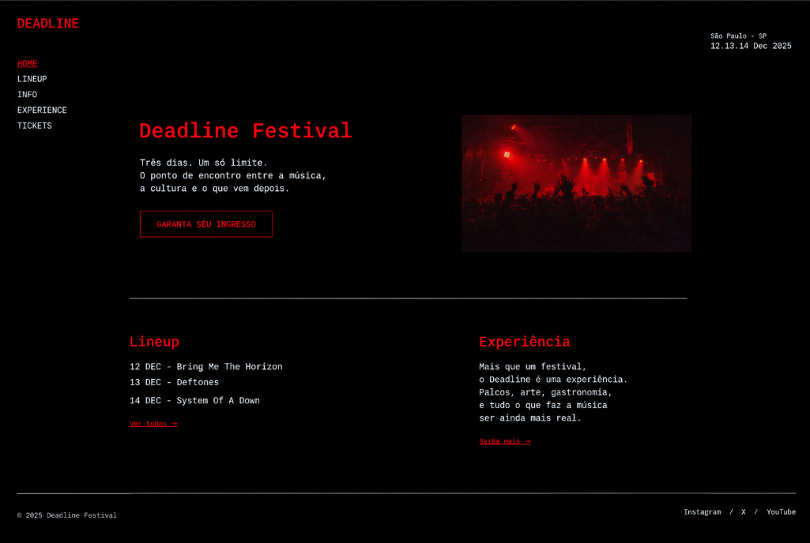
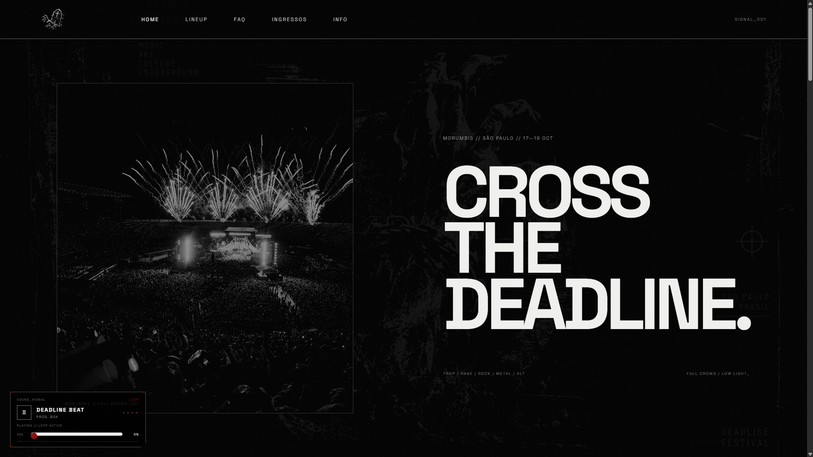

# DEADLINE FESTIVAL

**Dupla:** NOME 1 e NOME 2
**Site publicado:** COLE O LINK DA VERCEL AQUI

## Briefing

**Público:** jovens e adultos a partir de 16 anos que curtem trap, rage, rock, metal e alternative e procuram uma experiência musical intensa, visualmente agressiva e com escala de estádio.

**Clima:** barulhento, agressivo, underground.

**Paleta:**
- `#000000` — fundo principal e estrutura.
- `#F1F1EF` — textos principais.
- `#BFC1C4` — textos secundários e informação.
- `#8F1111` — destaque vermelho DEADLINE, chamadas e detalhes de impacto.

**Fontes:**
- Anton — títulos grandes e condensados, para reforçar impacto de cartaz.
- Space Grotesk — textos, navegação e informações técnicas, por ser legível e manter a estética digital/industrial.

**Inspirações:**
- https://g59records.com/tour — atmosfera underground e direção visual de tour.
- https://slipknot1.com/ — peso visual, escala de show e identidade musical.
- https://mainstreetrecords.com.br/ — referência para a apresentação dos artistas e player musical.

## Antes e depois

## Os 4 prompts que mais fizeram diferença

1. Definição da identidade visual do DEADLINE: underground + stadium scale, preto predominante, vermelho de impacto e tipografia pesada.
2. Refinamento da pré-home com a animação glitch e o CTA `CROSS THE DEADLINE`.
3. Desenvolvimento da Home com DEADMARK, DEAD LINE, seção de lineup, regras e MorumBIS.
4. Desenvolvimento das páginas individuais dos artistas com foto, origem, hit e player do Spotify.

## Estátua DEADLINE
A seção de regras usa 141 frames JPG em `img/statue-frames/`, numerados de `frame_001.jpg` a `frame_141.jpg`. A rotação é controlada pelo scroll da própria seção; a estátua permanece no mesmo lugar dentro do layout.
